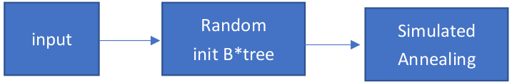

# CS6135 HW3 Report

## Compilation and Execution
- **Directory**: `HW3/src/`
- **Usage**: `../bin/hw3 <*.hardblocks> <*.nets> <*.pl> <*.floorplan> <dead_space_ratio>`
- **Example**: `$ ../bin/hw3 ../testcase/n100.hardblocks ../testcase/n100.nets ../testcase/n100.pl ../output/n100.floorplan 0.1`

## Performance Metrics
In my approach, I did not specifically account for the dead space ratio; instead, I focused on optimizing the layout to fit within the fixed outline constraints. Initially, I conducted experiments using a dead space ratio of 0.1, leading to identical results for both 0.1 and 0.15 ratios. The variance in runtime for Case 1 and others stems from the use of distinct parameters in each scenario, influencing the time it takes to conform to the fixed outline. Consequently, there isn't a direct correlation between the execution time and the number of modules."

| Case   | Dead Space Ratio | I/O Time | B*tree Init Time | Simulated Annealing Time | Total Runtime | Wire Length |
|--------|------------------|----------|------------------|--------------------------|---------------|-------------|
| Case 1 | 0.1              | 0s       | 1.08s            | 1037.48s                 | 1038.48s      | 293900      |
| Case 1 | 0.15             | 0s       | 1.08s            | 1037.48s                 | 1038.48s      | 293900      |
| Case 2 | 0.1              | 0.01s    | 2.32s            | 821.47s                  | 823.79s       | 512306      |
| Case 2 | 0.15             | 0.01s    | 2.32s            | 821.47s                  | 823.79s       | 512306      |
| Case 3 | 0.1              | 0.02s    | 3.02s            | 1003.75s                 | 1006s         | 724529      |
| Case 3 | 0.15             | 0.02s    | 3.02s            | 1003.75s                 | 1006s         | 724529      |
## Dead Space Ratio Analysis
- The objective was to determine the smallest dead space ratio that allows the program to produce a legal result within 20 minutes.
- Results for each case:
  - **Case 1**: 0.0983
  - **Case 2**: 0.097
  - **Case 3**: 0.0995

## Algorithm Details
- The project utilized the B* tree method and a fixed outline cost function for floorplanning. These methods were mentioned in the course lectures.
- References:
  - B* tree method: Chang, Chang, Wu, and Wu, “B*-Tree: A New Representation for Non-Slicing Floorplans,” DAC’00.
  - Fixed outline cost function: Chen and Chang, “Modern Floorplanning Based on Fast Simulated Annealing,” ISPD’05 & TCAD’06.

## Enhancements and Comparison
- The report discusses the challenges with the B* tree method, noting that it does not guarantee a fit within the fixed outline and often results in local minimum traps.
- Significant time was spent testing parameters to achieve the desired goals.
- A random approach was used to find seed values that would allow test cases to pass. However, this method was acknowledged as not being a general solution.

## Learning and Challenges
- The author's method required more than 10 minutes, and the solution quality significantly differed from the top 5 students.
- To improve speed and quality, techniques like fast simulated annealing and multi-level B*tree were considered.
    - Fast simulated annealing could avoid the pitfalls of regular simulated annealing, such as getting trapped in local minimums, and might lead to better solutions more quickly.
    - Multi-level B*tree, akin to dynamic programming, could segment the problem, first finding decent solutions, then refining them with fast simulated annealing.

