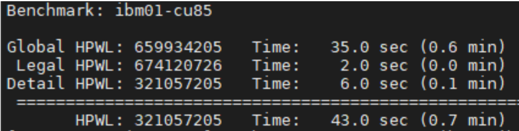
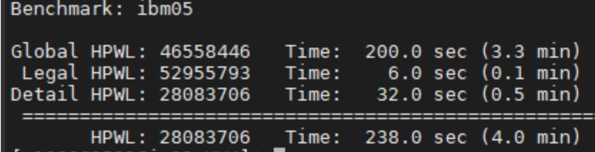
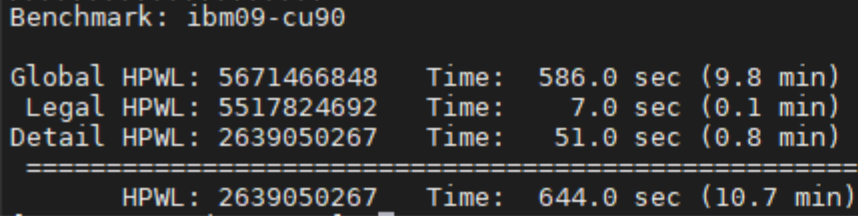
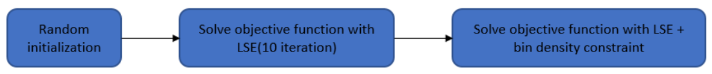

# CS6135 HW4 Report

## Wirelength and Runtime of Each Testcase
- Details about wirelength and runtime for various test cases are provided.

- Testcase1:

- Testcase2:

- Testcase3:

## Algorithm Details
- The algorithm involves initially placing each cell randomly, followed by optimization using LSE for wirelength, and finally dispersing cells with LSE and bin density constraints.

## Enhancements to Speed and Solution Quality
- The strategy involved using LSE to optimize wirelength in initial iterations, then applying bin density constraints for cell dispersion.

## Comparison with Previous Top Students
- The results are compared with the top 5 students from the previous year, focusing on runtime and solution quality.
- The report discusses improvements in wirelength and potential methods to balance quality and speed, like increasing iterations or integrating multi-level methods from the course lectures.
