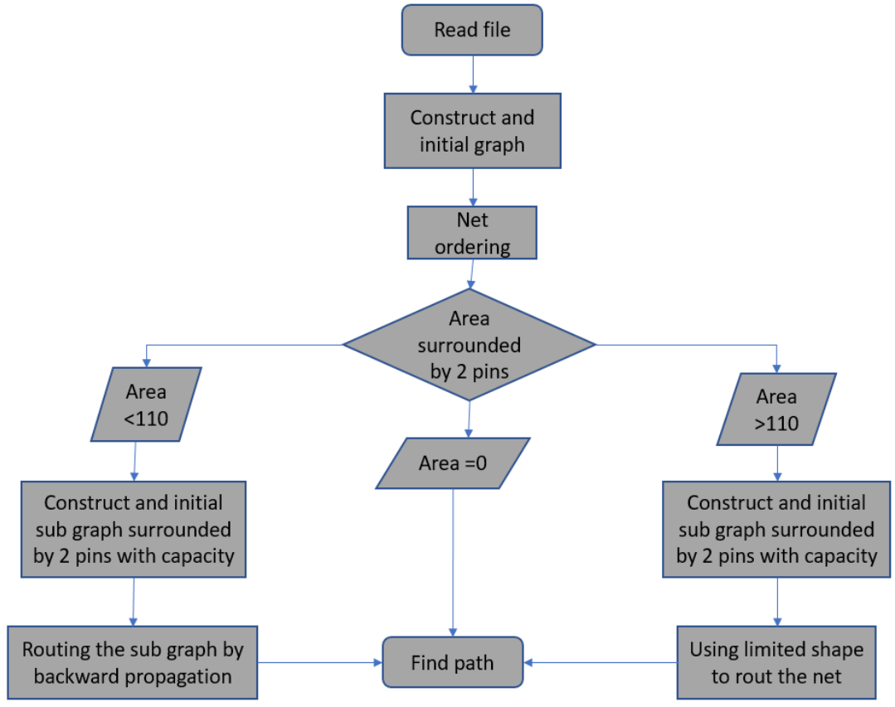
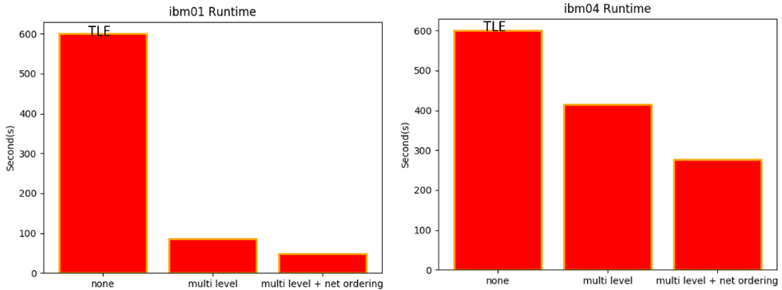
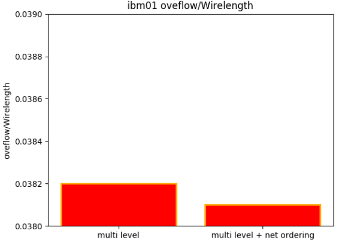
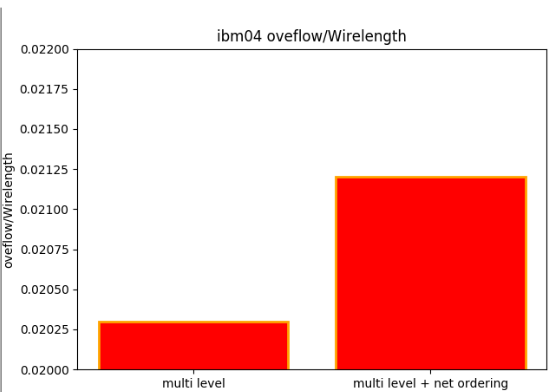

# CS6135 HW5 Report

## Compilation and Execution
- Compile and run the program: `./hw5 *.modified.txt *.result`
- Example: `./hw5 ../testcase/ibm01.modified.txt ../output/ibm01.result`

## Performance Metrics
- Metrics include total overflow, total wirelength, and runtime for each testcase.

  | Metric | Ibm01 | Ibm04 |
  |--------|-------|-------|
  | Input Time | 0.09s | 0.17s |
  | Output Time | 0.01s | 0.04s |
  | Net Ordering Time | 0.13s | 0.28s |
  | Routing Time | 48.41s | 275.69s |
  | Total Runtime | 48.79s | 276.13s |
  | Overflow | 2168 | 3273 |
  | Wirelength | 56773 | 154228 |

## Algorithm Details
- The implementation was inspired by Hadlock's method. Initially, a 2-pin net routing graph is established, incorporating capacity into the weight part to consider edge capacity during backward propagation.
- Challenges are noted when the initially established routing subgraph is too large, leading to extensive time spent on backward propagation. To address this, larger subgraphs use an L-shape method to find the path occupying the least capacity.

## Enhancements
- The approach involved using a multi-level method to route subgraphs of different sizes in distinct ways.
- For larger subgraphs, an L-shaped path was used to find the route occupying the least capacity.
- Additionally, net ordering was incorporated to improve solution quality.

## Learnings and Challenges
- Overall, the homework did not present significant difficulties. The main challenge was in algorithm design, specifically how to optimize the algorithm under capacity constraints to minimize overflow.
- The method was inspired by Hadlock's concept, incorporating capacity weight into backward propagation for more reference points. However, this approach was not feasible for too large subgraphs.
- Future improvements might include using a multi-level approach to break down larger subgraphs into smaller ones for more effective problem-solving.

